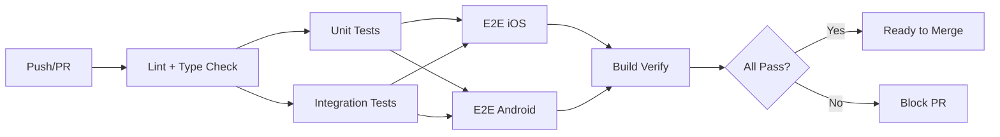

# Test Strategy — HabotConnect Parent-LSA App

## 1. Testing Philosophy

We follow the **Testing Trophy** model adapted for mobile:

```
        ╱╲
       ╱ E2E╲         (Few, high-value user journeys)
      ╱──────╲
     ╱Integration╲    (Component interactions, API calls)
    ╱──────────────╲
   ╱   Unit Tests    ╲  (Business logic, validation, utils)
  ╱────────────────────╲
 ╱   Static Analysis     ╲ (ESLint, TypeScript, a11y rules)
╱──────────────────────────╲
```

**Key Principle:** Test at the lowest level possible. Use E2E tests only for critical user journeys.

---

## 2. Test Pyramid Distribution

| Level | Coverage Target | Tool | What We Test |
|-------|----------------|------|-------------|
| **Static Analysis** | 100% of files | ESLint + TypeScript + a11y rules | Syntax, types, accessibility violations, code style |
| **Unit Tests** | 80%+ coverage | Jest | Validation logic, utility functions, component rendering |
| **Integration Tests** | Core flows | Jest + React Native Testing Library | Screen interactions, navigation, API integration |
| **E2E Tests** | Critical path | Detox | Parent-books-LSA journey, accessibility flows, performance |

---

## 3. Test Categories

### 3.1 Unit Tests (`__tests__/unit/`)

**Scope:** Individual functions and components in isolation.

**What:**
- `validation.test.ts` — All booking form validation rules, edge cases
- `LSACard.test.tsx` — Component rendering, accessibility props, interactions
- `BookingForm.test.tsx` — Form field rendering, error display, input handling

**Strategy:**
- Mock external dependencies (API, navigation)
- Test boundary values and edge cases
- Verify accessibility props (accessibilityLabel, accessibilityRole)
- Use snapshot tests for UI regression detection

### 3.2 Integration Tests (`__tests__/integration/`)

**Scope:** Multiple components working together through a user flow.

**What:**
- `booking-flow.test.tsx` — Complete Home → Search → Profile → Book → Confirm flow
- `search-filter.test.tsx` — Search input + filter panel interaction

**Strategy:**
- Use React Navigation test setup (NavigationContainer)
- Mock API layer but test real component interactions
- Verify screen transitions and data passing between screens
- Test accessibility announcements during flow

### 3.3 E2E Tests (`__tests__/e2e/`)

**Scope:** Full application on real device/simulator.

**What:**
- `parent-booking-lsa.e2e.ts` — The critical path E2E test
- `accessibility-check.e2e.ts` — WCAG 2.1 AA verification on device
- `performance-metrics.e2e.ts` — Performance regression gates

**Strategy:**
- Use Detox grey-box testing (no arbitrary waits)
- Test on both iOS and Android configurations
- Capture screenshots/videos on failure
- Enforce performance thresholds (startup < 3s, FPS > 55)

---

## 4. Why Detox Over Appium/Maestro

### Decision Record: ADR-001

| Factor | Detox ✅ | Appium ❌ | Maestro ⚠️ |
|--------|---------|----------|------------|
| **React Native support** | First-class (grey-box) | Generic (black-box) | Limited |
| **Synchronization** | Automatic (no flaky waits) | Manual `sleep()` required | Partial |
| **Speed** | Fast (no WebDriver overhead) | Slow (HTTP protocol) | Fast |
| **CI/CD** | Native GitHub Actions support | Heavy server setup | Good |
| **Debugging** | Detailed error messages | Generic failures | YAML-based |
| **Community** | Wix-maintained, active | Large but fragmented | Newer, growing |

**Decision:** Detox provides the best developer experience for React Native E2E testing. Its grey-box approach eliminates flaky tests caused by timing issues — a critical advantage for CI/CD reliability.

---

## 5. Test Data Management

| Data Type | Strategy | Location |
|-----------|---------|----------|
| Mock LSAs | Static fixtures in `api.ts` | `src/utils/api.ts` |
| Form data | Factory functions in test files | `__tests__/unit/` |
| API responses | Jest mocks | Test files |
| E2E data | Detox device setup + mock server | `__tests__/e2e/` |

---

## 6. CI/CD Integration



### Quality Gates:
- ❌ **Block merge** if ESLint a11y rules fail
- ❌ **Block merge** if unit test coverage < 80%
- ❌ **Block merge** if any integration test fails
- ❌ **Block merge** if E2E critical path fails
- ⚠️ **Warning** if performance thresholds near limits

---

## 7. Flaky Test Policy

1. **Zero tolerance** for flaky tests in main branch
2. All E2E tests use Detox synchronization — no `sleep()` calls
3. Failed tests produce screenshots + videos automatically
4. Retry logic: E2E tests retry once on failure before marking as failed
5. Flaky tests are quarantined and fixed within the same sprint
